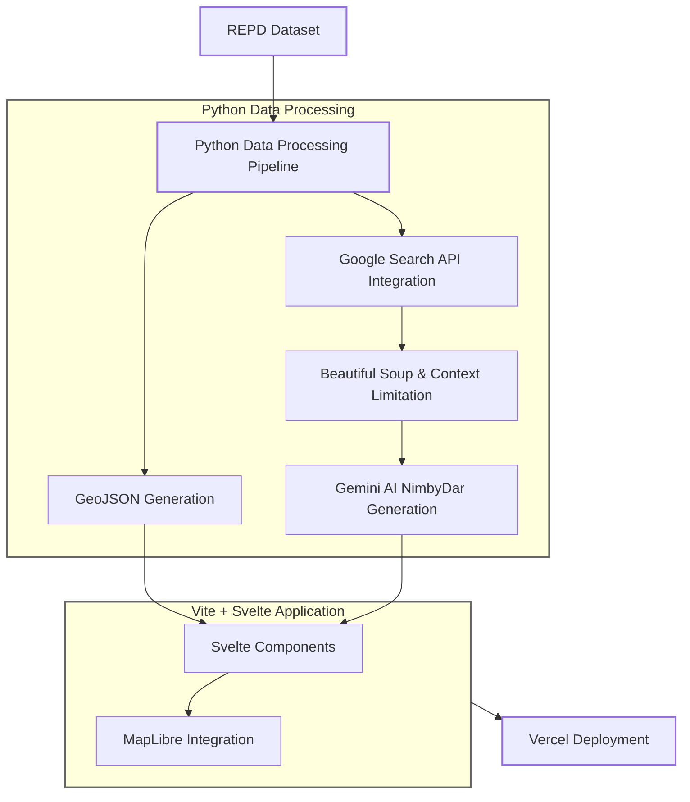

---
layout: center
class: text-center
---
# Big Statistics

<div class="grid grid-cols-3 gap-8 mt-8">
  <div class="stat text-center p-4 bg-purple-800 rounded-xl shadow-xl shadow-purple-800/20">
    <div class="stat-title font-bold">Total Capacity Lost</div>
    <div class="stat-value font-italic mb-4">6,584 MW</div>
    <div class="stat-desc">Since January 2022</div>
  </div>

  <div class="stat text-center p-4 bg-blue-800 rounded-xl shadow-xl shadow-purple-800/20">
    <div class="stat-title font-bold"> Average Days Before Cancellation </div>
    <div class="stat-value font-italic mb-4">334</div>
  </div>

  <div class="stat text-center p-4 bg-purple-800 rounded-xl shadow-xl shadow-purple-800/20">
    <div class="stat-title font-bold">Alan Tichmarsh</div>
    <div class="stat-value font-italic mb-4">Constant</div>
    <div class="stat-desc">Fabled BBC Presenter a common pattern in cancelled projects</div>
  </div>
</div>


---
---

# Frontend: First Svelte Experience

<div grid="~ cols-2 gap-4">
<div>
````md magic-move 
```javascript 
// - Hardest Part was integrating 
// Tailwindcss + daisyUI
// - Svelte data loading is pristine
// - Far easier to do javascript & reactivity
//+page.svelte
<script>
  import Map from '$lib/Map.svelte';
  export let data;
</script>  

<Map points={data.points} 
nimby_score={data.nimby_score}/>
```
```javascript 
//+page.js
export async function load({ fetch }) {
    try {
      const response = await fetch('/points.geojson'); 
      const nimby_r = await fetch('/nimby_score.json');  

      const geojson = await response.json();
      const nimby_score = await nimby_r.json();
      
      return {
        points: geojson.features,
        nimby_score: nimby_score
      };
    } catch (error) {
      console.error('Error loading GeoJSON:', error);
      return {
        points: []
      };
    }
  }
```

```javascript
### LOOK AT HOW CLEAN THIS LOOKS
#### I HATE REACT I HATE REACT I HATE REACT

// components/Map.svelte
<div class="grid grid-cols-2 gap-4" 
class:hidden={selectedFeature}>
    {#each stats as stat}
        <div class="stat shadow bg-base-100">
            <div class="stat-title">{stat.label}</div>
            <span class="stat-value">{stat.value}</span>
            <span class="stat-desc">{stat.trend}</span>
        </div>
    {/each}
</div>
```

````

</div>
<div>

</div>
</div>


---
layout: center
---

# Kryptonite of Gemini API  - Massive PDFs

<v-clicks>

- PDFs tend to be massive council minutes filled with irrevelant information
- Gemini has 1 mil token context length
- But API Costing is finite 

- Need to work out a better parsing method for large minutes.
</v-clicks>


---


# Challenges 

<v-clicks>

- MapGL Filtering is a labyrinth
- Dealing with massive PDF documents (even gemini can't deal with the pointless context length of council minutea)
- Google Search API rate limits
- Gemini sometimes getting too sassy with commentary
</v-clicks>

```js {*}{maxHeight:'250px'}
const accuracy1 = nimby_score.filter(item => item['Accuracy Score'] >= 70)
const accuracy2 = nimby_score.filter(item => item['Accuracy Score'] < 70)

const nimbyRefIds = new Set(accuracy1.map(item => item.refid || ''));
const nimbyRefIds2 = new Set(accuracy2.map(item => item.refid || ''));

// You expect me to believe this is logical?
'circle-color': [
    'case',
    ['boolean', ['feature-state', 'selected'], false],
    '#fbb03b',  
    [
        'case',
        ['in', ['get', refProperty], ['literal', [...nimbyRefIds]]],
        '#a8323a',  
        [
        'case',    
            ['in', ['get', refProperty], ['literal', [...nimbyRefIds2]]],
            '#ffa000',
            '#d3d3d3'   
        ]
    ]
],
```
---
# The Tech Stack 🔨

<v-clicks>

### Backend
- Pandas for Data Processing
- Google Search API for document retrieval 
- Beautiful Soup For scraping *ethicallly*
- Gemini AI API for snarky analysis
- MarkItDown for PDF, HTML, DOCX to MD conversion

### Frontend
- Vite & Svelte for fast web-app dev
- MapLibre GL for fancy maps
- Chart.js for radar diagrams
- GSAP for smooth animations
- Tailwind CSS for styling

### Hosting
- Vercel for hurting my wallet

</v-clicks>

<div class="h-100 flex items-center">


</div>


