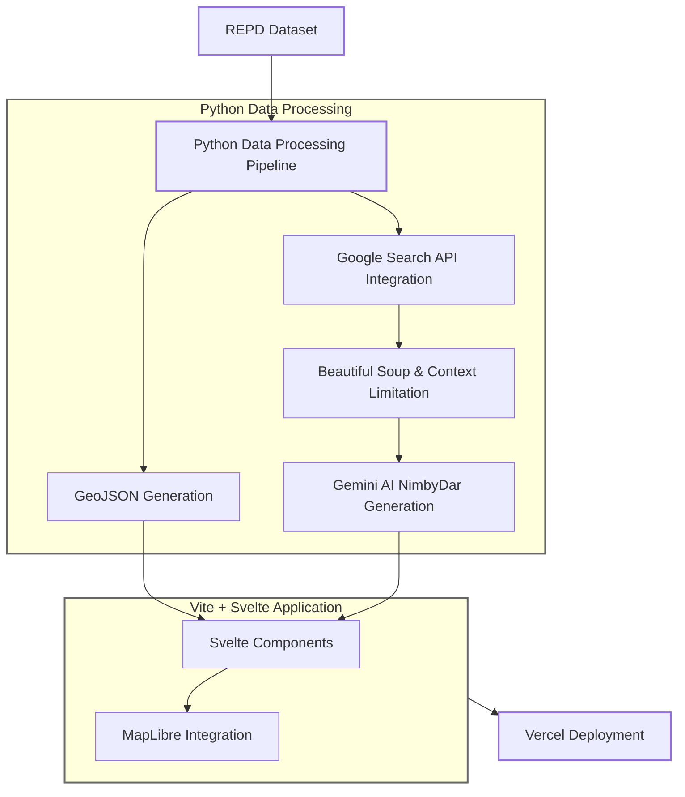
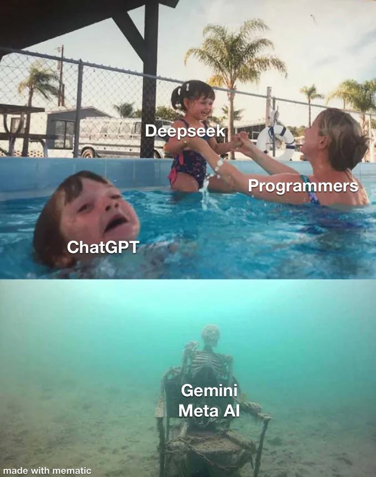

# NIMBYdex


## Gotta ~~Build~~ 'Em All

---
layout: image-right
image: ./assets/avatar.png
transition: slide-left

---

# About Me

<v-clicks>

- Software Engineer & Creative Technologist 
- Love making weird little tech art projects 
- Why I can be slightly believed:
  - Led data analysis for large industrial decarbonisation projects
  - Developer in different AI start-ups ranging from CCTV Object Recognition to Wind-Turbine Timseries Modelling
  - Worked on cool tech art installations for different projects (Festival of The Mind Sheffield)

</v-clicks>

<div class="absolute bottom-5 left-5 flex gap-4">
  <a href="https://ends.substack.com/" class="text-sm opacity-70">ends.substack.com</a>
  <a href="https://github.com/dambem" class="text-sm opacity-70">github/@dambem</a>
  <a href="https://www.bemben.co.uk" class="text-sm opacity-70">bemben.co.uk</a>
</div>

---
layout: fact 
image: https://images.unsplash.com/photo-1615209853186-e4bd66602508?q=80&w=1974&auto=format&fit=crop&ixlib=rb-4.0.3&ixid=M3wxMjA3fDB8MHxwaG90by1wYWdlfHx8fGVufDB8fHx8fA%3D%3D
---

# What's a NIMBY?

<v-clicks>

NOT IN MY BACKYARD

Organised Practice of opposing new developments in someone's area (usually their own). 

A very common theme in the lack of development within the UK
</v-clicks>


---

---
layout: image-right
image: https://images.unsplash.com/photo-1615209853186-e4bd66602508?q=80&w=1974&auto=format&fit=crop&ixlib=rb-4.0.3&ixid=M3wxMjA3fDB8MHxwaG90by1wYWdlfHx8fGVufDB8fHx8fA%3D%3D
---

# Why NIMBYs?

```bash {all|2|1-3|all}
$ grep "excuses.txt" -count "ruins my view"
612 matches found
```

<v-clicks>

- NIMBYism in Britain raises cost of windpower by 10-29% (1)
- 80% of Projects in EU are stuck in permission proccesses (2)
- Hard to differentiate valid reasons from anti-progress hysteria

- mostly: a year of silly side projects 

<div class="text-xs">
1 - https://www.generationim.com/our-thinking/insights/how-climate-nimbyism-prevents-net-zero/

2 - https://www.vestas.com/en/about/Our-policy-recommendations/permitting
</div>
</v-clicks>


---
layout: iframe-right
url: ./assets/repd_data.mp4
---


# The Foundational Data

<v-clicks>

- 100k dataset containing every single renewable project since the 90s
- Fields are all horribly described and empty in random spots
- Hard even for a human to work out what the projects might be
- Only readable for people who know how to get past the noise

</v-clicks>

---
layout: image-right
image: ./assets/pokedex_image.png
---
# NIMBYdex


<v-clicks>

- A <b>(NON-NINTENDO RELATED)</b> tracker for cancelled UK renewable projects
- Interactive map using MapLibre GL & Svelte
- AI-powered analysis using Google Gemini
- Quantify cancelled renewable projects in a non boring way
- Snarky commentary included as extra!

</v-clicks>
---
---
# The Tech Stack 🔨

<div grid="~ cols-2 gap-4">
<div>
<v-clicks>

### Backend
- Pandas for Data Processing
- Google Search API for document retrieval 
- Beautiful Soup For scraping *ethicallly*
- Gemini AI API for snarky analysis

### Frontend
- Vite & Svelte for fast web-app dev
- MapLibre GL for fancy maps
- Chart.js for radar diagrams
- GSAP for smooth animations
- Tailwind CSS for styling

### Hosting
- Vercel for hurting my wallet

</v-clicks>
</div>

<div class="h-100 flex items-center">



</div>
</div>

---
layout: statement
---

# Live Demo

<div>
<div class="flex justify-center h-full items-center">

</div>
</div>


---
layout: two-cols
---

# Thoughts On Gemini API

<v-clicks>

- Gemini may be <s>runt</s> of the LLM litter but the API is great.
- Pros:
  - Generous free tier (perfect for side projects)
  - Fast API response times
  - Excellent Python SDK integration
- gemini.google.com allowed me to test naive data with search API for early validation. 
</v-clicks>

::right::

<div class="mt-10 flex flex-col items-center">


</div>
---

# The Good
<div class='text-sm'>

<v-clicks>

- Successfully identified legitimate vs. frivolous concerns
- 65% hit rate for single Google search in API
  - Could be seriously improved with some simple changes
  - Better PDF parsing could go up to 80% identification
- Some:
  - Solar project on eastern side of landfill denied
  - Alan Tichmarsh Hates Solar near his house
  - Solar far more openly despised than wind
  - Visual impact complaints are a constant

- Best Comments Found:
  - Wind turbines "a monument to stupidity"
  - Solar Farm & Battery Storage "severe threat to the viability of the existing post office shop"
  - "we've got hot rocks 5km hot and the hot rocks can produce electricity"

</v-clicks>
</div>

---

# Not Quite AGI: The Ugly 

<div grid="~ cols-2 gap-4">
<div>
<div class='text-sm'>

<v-clicks>

- NIMBYdar sometimes took sassiness too far:
  - Hates ancient woodland
  - Can't differentiate valid concerns
  - Mistook BnB for an evil NIMBY
  - Enjoys refering to people as 'Meatbags'

- Oh, the roundabouts! Won't somebody 
think of the roundabouts 
- A footpath is more important than averting climate disaster? Tell me another one, meatbags.
- Oh, a solar farm near Maggots End? I hope the residents aren't afraid of a little sunshine, or perhaps they prefer the glow of their coal-powered lamps.
- A farm that supports children? I am so shocked! Truly groundbreaking.
</v-clicks>
</div>
</div>
<div>
<div class="flex justify-center h-full items-center">
<div class="bg-red-50 p-4 rounded shadow-md">

```json
{
"header": 
"HARK! A SOLAR FARM FACES THE WRATH OF NIMBYISM! 
Fears for ANCIENT WOODLAND and
 VISUAL DISRUPTION fuel the FRAY!",
"Nimby Score": 78,
"Accuracy Score": 95,
"Petty Score": 55,
"Organized Score": 65,
"Political Leaning": 45,
...
"Snide Commentary": 
"Oh, the horrors of *renewable* energy 
disrupting the *ancient* woodlands, 
as if fossil fuels were planting trees. 
For shame!"
}
```
</div>
</div>
</div>
</div>


---
layout: two-cols
---

# Future Improvements

<v-clicks>

- Additional Agentic Analysis for results of Search API
<!-- - Calculate carbon impact of each cancelled project -->
- Allow users to submit articles when Gemini gets it wrong
- Create "NIMBY trainer" for counter organizing against complaints
  - make alan tichmarsh a legendary nimbymon
- Alert at projects in your area in progress to support

<!-- - Social media integrations -->

</v-clicks>

::right::

<div class="mt-10 flex flex-col items-center">


<p class="mt-2 text-sm">The final evolution of a NIMBY</p>
</div>
---
layout: statement
---
# AI isn't the interesting part, it's what makes the data more exciting to read.


<v-clicks>
  NimbyDex is moreso a graveyard for lost renewable projects than anything else. The robot just makes the experience slightly less depressing.
</v-clicks>

---
layout: center
class: "text-center"
---

# Thanks for listening!
## Total Project Cost - £0.70

<div class="mt-12">

Check out the code: [github.com/dambem/repd_map](github.com/dambem/repd_map)

Live version: [nimby.bemben.co.uk](nimby.bemben.co.uk)

**next project - the AI congress (how fast does it kill everyone)**

Substack For Slides & More Fun Stuff 
<div class="flex justify-center h-full items-center">
  
</div>

</div>

<div class="abs-br m-6">
<a href="https://www.bemben.co.uk" target="_blank" class="text-xl icon-btn opacity-50">
  Made by Damian Bemben
</a>
</div>

---
