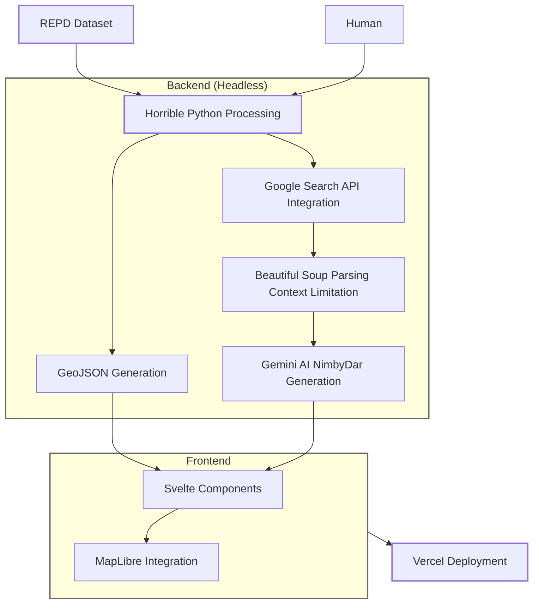
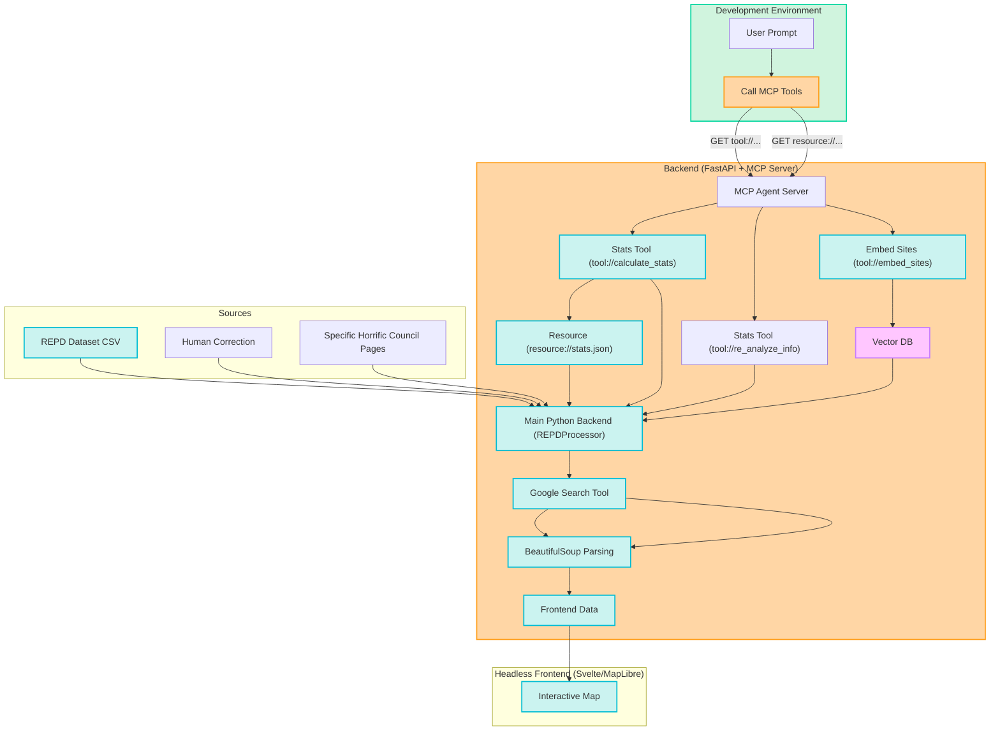

# NIMBYdex

## Gotta ~~Build~~ 'Em All

---
layout: image-right
image: ./assets/avatar.png
transition: slide-left
---

# About Me

<v-clicks>

- Software Engineer & Creative Technologist 
- Love making weird little tech art projects 
- Why I can be sometimes believed:
  - Led data analysis for large Industrial decarbonisation projects
  - Developer in AI start-ups ranging from CCTV Object Recognition to Wind-Turbine Timeseries Modelling
  - Worked on cool tech art installations for different projects (Festival of The Mind Sheffield)

</v-clicks>

<div class="absolute bottom-5 left-5 flex gap-4">
  <a href="https://ends.substack.com/" class="text-sm opacity-70">ends.substack.com</a>
  <a href="https://github.com/dambem" class="text-sm opacity-70">github/@dambem</a>
  <a href="https://www.bemben.co.uk" class="text-sm opacity-70">bemben.co.uk</a>
</div>
---

# LLM, Agents, RAG, & MCPs 

Before we get to the funny, we gotta talk definitions. People write articles about each, here's them in single sentences.

<v-clicks>

- <b>Large Language Model (LLM)</b> - Machine learning model trained on the internet and pirated books.

- <b>Agents </b> - Giving an LLM access to tools, memory and planning, and selling it for £10 million

- <b>Retrieval Augmented Generation  (RAG)</b> - Giving an LLM access to correct context, so that it doesn't tell you to eat rocks.

- <b>Model Context Protocol (MCP)</b> - A protocol to let an LLM access controls in an application, so when it kills the world the process will at least be standardised.
</v-clicks>


---
layout: fact 
image: https://images.unsplash.com/photo-1615209853186-e4bd66602508?q=80&w=1974&auto=format&fit=crop&ixlib=rb-4.0.3&ixid=M3wxMjA3fDB8MHxwaG90by1wYWdlfHx8fGVufDB8fHx8fA%3D%3D
---

# What's a NIMBY?

<v-clicks>

**NOT IN MY BACKYARD**

Organised practice of opposing new developments in someone's area (usually their own). 

A very common theme in the lack of development within the UK

</v-clicks>

---
layout: image-right
image: https://images.unsplash.com/photo-1615209853186-e4bd66602508?q=80&w=1974&auto=format&fit=crop&ixlib=rb-4.0.3&ixid=M3wxMjA3fDB8MHxwaG90by1wYWdlfHx8fGVufDB8fHx8fA%3D%3D
---

# Why's a NIMBYs?

```bash {all|2|1-3|all}
$ grep "excuses.txt" -count "ruins my view"
612 matches found
```

<v-clicks>

- NIMBYism in Britain raises cost of windpower by 10-29% (1)
- 80% of Projects in EU are stuck in permission processes (2)
- Hard to differentiate valid reasons from anti-progress hysteria
- Mostly: a year of silly side projects 

</v-clicks>

<div class="text-xs mt-8">
1 - https://www.generationim.com/our-thinking/insights/how-climate-nimbyism-prevents-net-zero/<br>
2 - https://www.vestas.com/en/about/Our-policy-recommendations/permitting
</div>

---
layout: iframe-right
url: ./assets/repd_data.mp4
---

# The Foundational Data

<v-clicks>

- Massive dataset containing every single renewable project since the 90s
- Fields are all horribly described and empty in random spots
- Hard even for a human to work out what the projects might be
- Only readable for people who know how to get past the noise

## Other Issues
- Every Council has a different database of projects

</v-clicks>

---
layout: image-right
image: ./assets/pokedex_image.png
---

# NIMBYdex V1

<v-clicks>

- A **(NON-NINTENDO RELATED)** tracker for cancelled UK renewable projects
- Interactive map using MapLibre GL & Svelte
- AI-powered analysis using Google Gemini
- Quantify cancelled renewable projects in a non-boring way
- Snarky commentary included as extra!

</v-clicks>

---
layout: statement
---

# Live Demo

<div class="flex justify-center h-full items-center">
  
</div>

---

# The Tech Stack (V1) 🔨

<div grid="~ cols-2 gap-4">
<div>

<v-clicks>

### Backend
- Pandas for Data Processing
- Google Search API for duct-taped RAG
- GeminiAI for snarky analysis
- BeautifulSoup for scraping *ethically*
- MarkItDown for converting to MD

### Frontend
- Vite & Svelte for fast web-app dev
- MapLibre GL for fancy maps
- Chart.js for radar diagrams
- GSAP for smooth animations

### Hosting
- Vercel for hurting my wallet

</v-clicks>

</div>
<div class="h-100 flex items-center">



</div>
</div>

---
layout: two-cols
---

# Thoughts On Gemini

<v-clicks>

- Gemini may be ~~runt~~ the best of LLM litter 
- Pros:
  - Generous free tier (perfect for side projects)
  - Fast API response times
  - Excellent Python SDK integration
- gemini.google.com allowed me to test naive data with search API for early validation
- Easy **MCP** & Custom Agent Integration

</v-clicks>

::right::

<div class="mt-10 flex flex-col items-center">
  
  <p class="mt-2 text-sm">Reverse this</p>
</div>

---

# The Good

<div class='text-md'>

<v-clicks>

- Successfully identified legitimate vs. frivolous concerns with correct *ground truth*

- Some findings:
  - Solar project on eastern side of landfill denied
  - Alan Tichmarsh hates solar near his house

- Best comments found:
  - Solar Farm & Battery Storage "severe threat to the viability of the existing post office shop"
  - "we've got hot rocks 5km hot and the hot rocks can produce electricity" 
    - -- Actual, Genuine Quote from a councillor.

</v-clicks>

</div>

---

# Not Quite AGI: The Ugly 

<div grid="~ cols-2 gap-4">
<div>

<div class='text-sm'>

<v-clicks>

- NIMBYdar sometimes took sassiness too far:
  - Hates ancient woodland
  - Mistook BnB for an evil NIMBY
  - Enjoys referring to people as 'Meatbags'

- "Oh, the roundabouts! Won't somebody think of the roundabouts?"
- "Oh, a solar farm near Maggots End? I hope the residents aren't afraid of a little sunshine, or perhaps they prefer the glow of their coal-powered lamps."

</v-clicks>

</div>
</div>
<div>

<div class="flex justify-center h-full items-center">
<div class="bg-red-50 p-4 rounded shadow-md">

```json
{
  "header": 
    "HARK! A SOLAR FARM FACES THE WRATH OF NIMBYISM! 
     Fears for ANCIENT WOODLAND and
     VISUAL DISRUPTION fuel the FRAY!",
  "Nimby Score": 78,
  "Accuracy Score": 95,
  "Petty Score": 55,
  "Organized Score": 65,
  "Political Leaning": 45,
  "Snide Commentary": 
    "Oh, the horrors of *renewable* energy 
     disrupting the *ancient* woodlands, 
     as if fossil fuels were planting trees. 
     For shame!"
}
```

</div>
</div>
</div>
</div>

---

# Model Context Protocol - Why?

<v-clicks>
The set-up for Nimbydex V1 was simple - and quickly became crazy.

- Data Changes Often, can get better sources of truth for specific renewables

- Ambigious as to what the "better" article is. 

- Some sources need to use different tools depending on structure, and i'm lazy.

- Wasted repeated searches that don't create a better result

<hr>

###  Model Context Protocol 

- Provides a structured way of interacting with Python Backend

- Seperate Agnostic Agent that provides Instructions to review and repeat

- Allows for cleaner development.

</v-clicks>
---

# Model Context Protocol - Is It Hard To Do?
<v-clicks>

````md magic-move

```python 
from fastapi import FastAPI
from funcs.scrape_and_analyse import scrape_content, gemini_process

app = FastAPI()

@app.post("/process-gemini")
def post_scrape_content(url: str, mime: str) -> str:
    """Scrape Content - Scrapes content into a maximum character limit with specific actions based on mimetypes.
    Args:
        url (str): URL of content to scrape
        mime (str): MimeType of Content To Scrape
    Returns:
        str: Scraped content as string.
    """
    return scrape_content(url, mime)

```

```python 
from fastapi import FastAPI
from funcs.scrape_and_analyse import scrape_content, gemini_process
from fastmcp import FastMCP

mcp = FastMCP("NimbyDex")
mcp_app = mcp.http_app(path='/mcp')

app = FastAPI()
app.mount("/mcp-server", mcp_app, "mcp")

@app.post("/process-gemini")
def post_scrape_content(url: str, mime: str) -> str:
    """Scrape Content - Scrapes content into a maximum character limit with specific actions based on mimetypes.
    Args:
        url (str): URL of content to scrape
        mime (str): MimeType of Content To Scrape
    Returns:
        str: Scraped content as string.
    """
    return scrape_content(url, mime)

```
```python 
from fastapi import FastAPI
from funcs.scrape_and_analyse import scrape_content, gemini_process
from fastmcp import FastMCP

mcp = FastMCP("NimbyDex")
mcp_app = mcp.http_app(path='/mcp')

app = FastAPI()
app.mount("/mcp-server", mcp_app, "mcp")

@mcp.tool()
def post_scrape_content(url: str, mime: str) -> str:
    """Scrape Content - Scrapes content into a maximum character limit with specific actions based on mimetypes.
    Args:
        url (str): URL of content to scrape
        mime (str): MimeType of Content To Scrape
    Returns:
        str: Scraped content as string.
    """
    return scrape_content(url, mime)

```
````

No - As long as you don't care about security 
</v-clicks>
---

# Tech Stack With MCP (TBD)


<div grid="~ cols-2 gap-4">

<div class="h-100 flex items-center">



</div>
</div>
---
layout: image-left 
image: ./assets/shoggoth.jpeg
---

# The Shoggoth Of British Planning

<v-clicks>

But are NIMBYs actually the issue? 

At first I thought so. They're easy to blame. But then I began unravelling reading the NimbyDar.

The real enemy might be something much larger and harder to control.

- Council Websites with no easy parsing
- Systems with no shared schemas, structure or sanity
- Hundreds of documents for 150kw solar farms
- Maybe it wasn't the <b>NIMBY</b> all along?

</v-clicks>

---
layout: image-left
image: ./assets/faw_side.png
---
# A Terrifying Study

**Faw Side Community Wind Farm**  
315MW, 45 Turbines

<v-clicks>

How long do you think this took to refuse?


**4.589 Years**

Total of 496 Documents. 111 Public Representations. 285 Application Documents. 

Kafka would turn in his grave.

</v-clicks>

<div class="mt-8 flex justify-center">
  
</div>


---

# Future Improvements

<v-clicks>

- Continue investigating the "Planning" Shoggoth
- Allow users to submit corrections when Gemini gets it wrong
- Create "NIMBY Trainer" for local counter-organizing against complaints
- Make Alan Tichmarsh a legendary NimbyMon card (and don't get sued)
- Alert users to projects in their area in progress to support

</v-clicks>

---
layout: statement
---

# AI isn't the interesting part, it's what makes the data more exciting to read.

<v-clicks>

NimbyDex is more a graveyard for lost renewable projects than anything else. The robot just makes the experience slightly less depressing.

</v-clicks>

---
layout: center
class: "text-center"
---

# Thanks for listening!

## Total Project Cost - £3.70

<div class="mt-12">

**Live version:** [nimby.bemben.co.uk](https://nimby.bemben.co.uk)

**Next project:** The AI Congress (how fast does it kill everyone?)

**Other weird projects:**  
A weird little planet: [solaris.bemben.co.uk](https://solaris.bemben.co.uk)

**Subscribe to Substack for slides & fun bits:**

<div class="flex justify-center mt-6">
  
</div>

</div>

<div class="abs-br m-6">
  <a href="https://www.bemben.co.uk" target="_blank" class="text-xl icon-btn opacity-50">
    Made by Damian Bemben
  </a>
</div>

